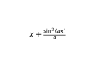
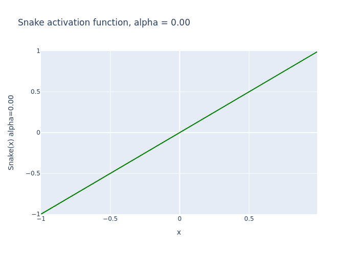

# Snake
Based on ["Neural Networks Fail to Learn Periodic Functions and How to Fix It"](https://arxiv.org/abs/2006.08195) by Liu Ziyin, Tilman Hartwig, Masahito Ueda

This is a PyTorch implementation of the `snake` activation function from the paper - or at least I _think_ it is, no affiliation with the authors, use at your own risk, etc., etc.  Huge thanks to contributors [klae01](https://github.com/klae01) and [fedebotu](https://github.com/fedebotu) who made big improvments to the code.

A few variations of the function are discussed in the paper, this package implements:

 
Snake is **periodic**, but _also_ monotonic. To see how **snake** behaves for a range of x given various choices of `a`, watch this animation:

## Installation
Two methods:
- Using **pip**, `pip install torch-snake`
- To install from source, first clone this repository.  Then, from the main repo folder, run `python setup.py install`

## Usage
Fairly easy really `from snake.activations import Snake`.  The `Snake` constructor [(code here)](snake/activations.py) has a trainable parameter `a` controlling the frequency of the periodic term.  If `a` is omitted, each element of `a` is initialized from an exponential distribution.  The authors of the paper find values between 5 and 50 work quite well for "known-periodic" data, while for better results with non-periodic data, you should choose a small value like 0.2.  You can pass a fixed starting value for `a` (for example `Snake(features, a=5.0)`) and disable learning entirely by setting `trainable=False`.

## Sample code
There's a notebook, still quite rough - [example.ipynb](example.ipynb).  Early indications are that good choices of hyperparameters are quite important for best results (though snake's own parameter trains quite readily).

## Acknowledgements
This code probably wouldn't have gotten written if it hadn't been for [Alexandra Deis](https://towardsdatascience.com/@astakhova.aleksandra) and [her excellent article](https://towardsdatascience.com/extending-pytorch-with-custom-activation-functions-2d8b065ef2fa) .
